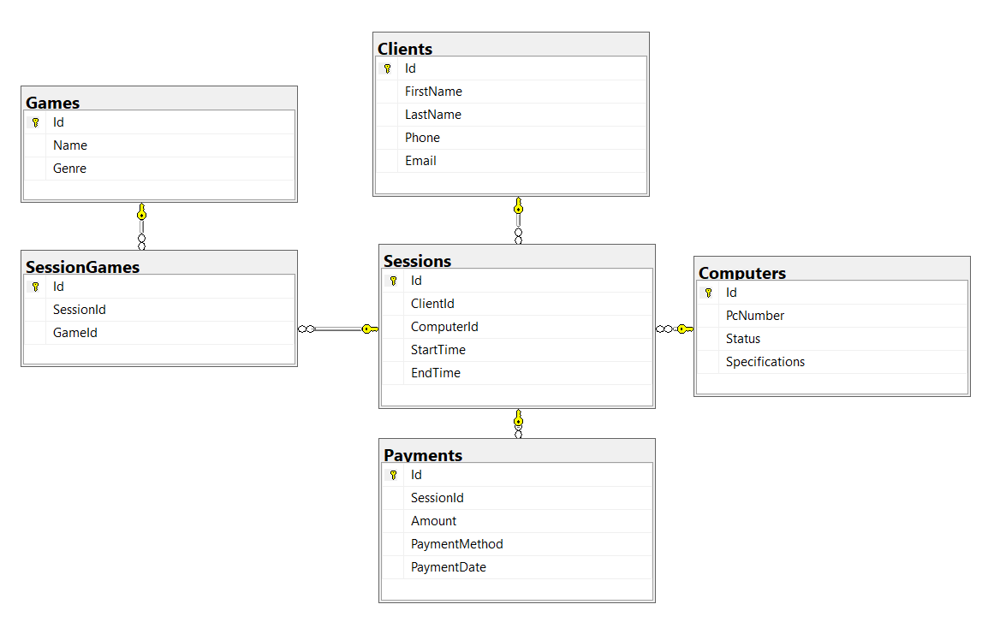

# Internet Café Management System

## Description

The Internet Café Management System is a Windows Forms desktop application developed in C# (.NET 10) designed to manage the daily operations of an Internet Café.

The system provides functionality for managing clients, computers, gaming sessions, and payments. The main goal of the application is to track computer usage, monitor active sessions, and calculate the total revenue generated by the café.

The application is built using a layered architecture approach, separating data access, business logic, and presentation layers for better maintainability and scalability.

---

## System Features

The application includes the following core features:

- Management of clients (add, edit, delete, view)
- Management of computers and their status (available, occupied, broken)
- Game library management
- Session tracking between clients and computers
- Payment tracking for each session
- Data visualization using DataGridView components
- SQL Server database integration

---

## Database Structure and Relationships

The system is built on a relational SQL Server database named **Internet_Cafe_DB**, which contains the following tables:

- Clients
- Computers
- Games
- Sessions
- SessionGames
- Payments

### Relationships between tables:

- A Client can have multiple Sessions (1:N)
- A Computer can be used in multiple Sessions (1:N)
- A Session can include multiple Games (N:M via SessionGames)
- Each Session has one or more Payments

---

## Figure 1: Database ER Diagram (logical representation)

Clients 1 ──── N Sessions N ──── 1 Computers  
Sessions 1 ──── N SessionGames N ──── 1 Games  
Sessions 1 ──── N Payments  

---

## Technologies Used

- C# (.NET 10)
- Windows Forms
- Entity Framework Core
- SQL Server Express
- LINQ
- ADO.NET (for queries and data loading)

---

## Application Architecture

The project follows a modular structure:

- **Forms/** → User interface (Windows Forms)
- **Models/** → Entity definitions for database tables
- **Data/** → Database context and initialization logic
- **Services/** → Data access and query handling logic

---

## Project Status

### Week 1 – Completed
- Requirements analysis
- Project setup
- Folder structure created

### Week 2 – In Progress
- Database schema design
- Table creation scripts
- Seed data implementation
- Database connection setup

### Week 3 – In Progress
- UI development with DataGridView
- Data binding using EF Core
- Navigation between forms

---

## Notes

Although the original assignment required a simplified system (Client, Course, Enrollment), this project extends the functionality into a more complex real-world system by implementing an Internet Café Management System with additional entities and relationships.

---

## Author

C# Windows Forms Project – Academic Practice